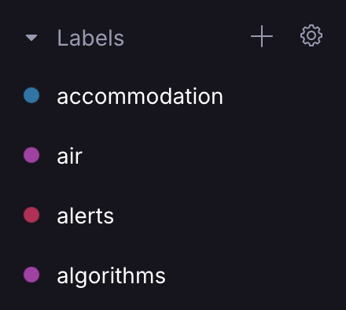

# HEY Proton!

**Advanced Sieve Filters for Proton Mail**

These Sieve filters implement the concepts of a HEY-styled email client combined with the power of the Contact Groups feature in Proton Mail for advanced customization and flexibility.

<div style="text-align: center;">
   
  
  
</div>

It also provides a clear path to migrate away from your old email addresses to a more secure aliased system.

Adopt my system to avoid:

- rolling your own;
- discovering undocumented Proton issues yourself;
- making scores of labels in Proton to try and 'imply' variables not directly debuggable in Sieve; and
- needing to go back to the Sieve _draft_ RFCs from 1991 for further clarifications 🤦‍♂️

## Caution

I have tested this fairly comprehensively, but since it uses relative dates it is _designed to set some of your emails to immediately expire on first run_.

It also adopts a highly opinionated workflow in the manner it chooses to expire some items, in particular, alerts designated as non-critical.

I may be up for accepting suggestions or even PRs, but this is a personal project and my time and support is not guaranteed. Use at your own risk.

## Concepts

The workflow can be represented by only 4 folders in use:

- `Inbox`
- `The Feed`
- `Paper Trail`
- `Screener`

with labels used for any further classification within these.

This email flow preserves your time and attention with concepts inspired by Hey, plus a few extras:

### Paper Trail

Most of what you recieve via email is a `receipt`, `statement`, `return`, `tracking` update or `transaction` that you would like to have on hand for a while, but usually don't need to review individually.

Anything going into the `Paper Trail` is marked as seen and set to expire in 2 years, unless it has an attachment or is part of your personal `conversations`.

### Screener

Except for important or timely alerts, any messages from contacts you haven't seen before should go to the `Screener` first, and have those contacts classified in some way before their emails will fully enter your workflow in future.

### The Feed

Newsletters for casual reading purposes should arrive in a flow whereby old content is pushed down and eventually discarded.

If an email arrives from the `Newsletter` contact group, it will be placed in `The Feed`. In addition, if it is not listed in any other contact group, it is assumed to be for entertanment only, and will be set to expire in 3 months. This keeps your Feed fresh.

### Inbox

Finally, only those emails:

- requiring immediate or more timely attention as an `alert`; or
- mail from contacts you have previously screened and classifed, which don't fit into the categories above;

will actually make it to your Inbox and ask for your attention.

## Interplay with Proton contact groups

Using Protons' contact groups, we can create a contact to hold a new unknown email to one or more new contacts, and also individually assign each of the emails under a contact to different contact groups:

<div style="text-align: center;">
  
</div>

Once an email address is added to a contact, it will no longer hit the `Screener`, and the lower case version of its name will be applied as a label (if you have created it, as below).

You don't need to add the email to any contact groups for this, but additionally assigning it to various contact groups will then have any mapped labels of those groups applied to each new email from that address:

<div style="text-align: center;">
  
  
</div>

Although less portable than having this all written in Sieve, in practice the code doesn't translate anyway due to Proton's unique extensions to the language. Furthermore, it gives you a really nice and fast UI for updating existing contacts to existing groups:

<div style="display: flex; justify-content: center;">
  
</div>

## Contact group versus email alias classification

I used to create emails like `company.category.subcategory@mydomain.com` for automatic label generation from the `category` and `subcategory`. While effective, it proved brittle: for instance, merging my `banking` and `investments` labels into a single `finance` label left my old `company.banking@mydomain.com` addresses no longer able to generate useful labels, requiring manual updates.

Now, I use Proton contact groups and just generate email addresses like `companyorwebsitename.randomword@mydomain.com`, separate from labeling. Assigning them to contact groups on first receipt offers flexibility and allows grouping different emails under one contact.

I still use the alias auto-labelling approach for some things like newsletters, to save me having to add a contact for every single email.

## Installation

These scripts are set up to be maintained using Github and concatenated into a
single script on local commit, using the provided `generate.sh` script.

This ensures the whole filter can be run at once in Proton and deleted (to stop)
for testing purposes and without any deterministic issues.

### Minimum required Proton setup

You will need to go through the code and understand the labels used to modify for your own use case. Proton will not automatically create these, so you either need to create them all as per this system or implement your own.

However, some labels are suggested for minimum baseline functionality. These are:

- Folders: `The Feed`, `Paper Trail` and `Screener`.
- Contact Groups: `Newsletters`, `My Addresses` and optional `My Old Addresses` and `My Migration Exceptions` as below.
- Minimum labels: `alerts`, `security` `expiring`,`needs admin`, and `newsletters`.
- Paper Trail labels: `receipts` `returns`, `shopping`, `statements`, `tracking` and `transactions`

Beyond this, you can add as many extra labels mentioned in `03 - label decoration.sieve` as you like to get extra classification granularity beyond the baseline folder system.

### Populating user-specific data

Using separate files for user-specific setup data along with script-based expansion macros ensures a single source of truth can be preserved for these lists on first creation or when they need updating.

The `scripts/generate.sh` script is used to expand entries in files in your `/private` directory. You will need to create the source text files in `private` yourself since they contain personal information.

You can run this script directly one-time in Bash to populate `/dist/output.sieve`:

```bash
chmod +x scripts/generate.sh
scripts/generate.sh
```

to generate `/dist/output.sieve`, ready to paste into Proton Mail as a single filter.

### Optional contact groups

#### `My Addresses`

Emails will be ignored if they are sent from a mail in the `My Addresses` contact group. This is used to exclude sent items from further classification, as I prefer.

#### `My Old Addresses`

Email adresses can also be added to an `My Old Addresses` contact group if they refer to old pre-Proton accounts for which you wish to be reminded to update the senders/accounts. Use this if you want this mail also marked as `needs admin` and sent to the `Screener`, to remind you to update the accounts still containing this address.

This can be further managed by the variable `migration_date_in_days_ago` to make sure every single old email copied to proton is not flagged on first run. It is also specified as a relative rather than absolute day to ensure that after you have fixed a bunch of accounts, but still have the old emails, these will not all get flagged up again if you re-run from scratch some time later.

It is recommended though that you run the filters originally with `migration_date_in_days_ago` backdated a month or two, migrate any obvious addresses, and then set it to 0 going forward.

#### `Unwanted` contacts

This is a special optional `Unwanted` contact group for mail that you don't want to block, but you don't want to see or have further labelled at all. Items will be archived and expire in 7 days.

#### `My Migration Exceptions`

This is another optional contact group - members won't get flagged up as `needs admin` if they are not yet migrated. Use this for use cases like:
- senders that you know you need to migrate, but can't yet (waiting on response); or
- for mail that you can't ever migrate
  - for example, if you have moved all email from a Google account, but still use Drive or Photos on it, you can still expect emails from `@google.com` to that address.

### Example user config files

Format for each text file is one entry per line. Refer to `/private-examples` for some starting examples (and minimum baseline labels in `contact groups.txt`).

- `contact groups.txt` - list your Proton contact groups in here
- `email alias regexes.txt` - new emails you generated on the fly where the labelling information is already encoded in the address.

## Development

Should you wish to fork this or submit a PR, it's good to keep in mind the following principles:

## File flow

Each sieve filter is designed to run in a specific order and and conform to certain rules for each file, to ensure that the flow is respected. Please refer to the rules in the comment header of each file for more details.

### Editing

- Always `expire` using a declared grace period from setup, never delete directly or send to `Trash`.
- Avoid the use of `return` in individual files, as they will not end up in separate filters; only use `stop` if required.
- Avoid filing into `Inbox`, as re-running will mess with emails already manually processed.
- The exception to this is for `alerts`; if you do want to file anything into `Inbox`, you can
  check against `${migration_julian_day}` first to avoid dredging up your deep mail history.

### Setting Up a `git` pre-commit hook

Rather than run the `generate.sh` script each time, can also symlink it as a `git` pre-commit hook if you wish to make further changes to it as a repository:

```bash
# Navigate to the .git/hooks directory
cd .git/hooks

# Create a symlink to the pre-commit hook script in your repository
ln -s ../../scripts/generate.sh pre-commit

# Make the hook script executable
chmod +x ../../scripts/generate.sh
```

You will then trigger `dist/output.sieve` generation on each commit.

### Proton/Sieve Gotchas

#### Marking as "seen" is buggy or non-deterministic.

For best results, I do it after each group of expiry and filing into folders, e.g.:

```
  expire "day" "${paper_trail_expiry_relative_days}";
  addflag "\\Seen";
  fileinto "Paper Trail";
  fileinto "expiring";
  fileinto "tracking";
  addflag "\\Seen";
```

#### `expiry` has an undocumented maximum expiration period.

The `proton.vnd.expiry` extension has a maximum supported expiration date of 2 years (730 days).

Again, this is undocumented and I only discovered it through trial and error. If you set 1500, it will set to the max of 730 for you, and if you set to 2000, it will just not set the expiration at all.

### Sieve does not support regex shorthands.

Sieve doesn't support any shorthands like `\\b`, `\\d`, `\\W` etc.

The spec that _MUST_ be supported is listed here: https://datatracker.ietf.org/doc/id/draft-ietf-sieve-regex-01.html#RFC5228

This tripped me up for days as it means inspecting regexes will fail not for the reason you think - eg in the example below, I thought Julian date extraction was broken:

```sieve
if currentdate :zone "+0000" :matches "julian" "*" {
    if not string :regex "${1}" "^\\d+$" {
        fileinto "fails; this label is set, but only because \\d doesn't work";
    }
    if not string :comparator "i;ascii-numeric" :value "ge" "${1}" "0" {
        filentio "passes; this label is set";
    }
}
```

### 'fileinto' application order

After driving myself crazy trying to figure out how new labels were applied, and why it didn't seem deterministic, I realized it just displays them in alphabetical order 😂
